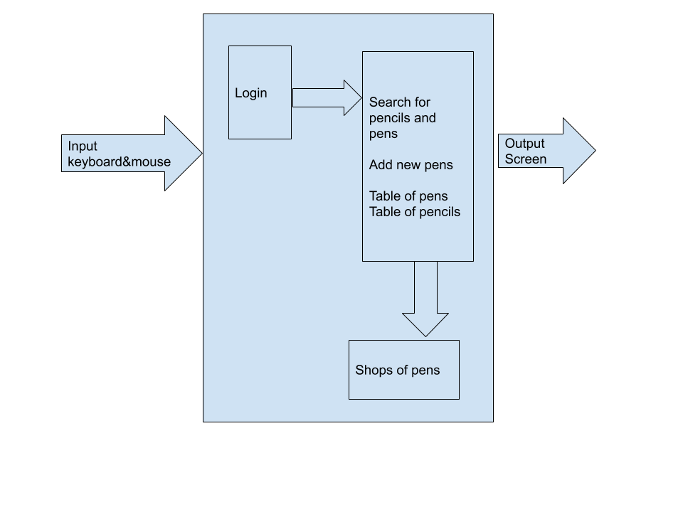

# INVENTORY Project Unit 3

# Planning
### Definition of problem
I am chosen such a developer of an inventory from the client appointed Khalid Ismail from Somalia, Student attending  UWC ISAK JAPAN and class' 2021, the purpose of his order came from his worries with pen and pencils in his house which are such in mess and spread out from all the corner of his house. As said, in his room, he has a bunch of pen including pencils that when he wants to use any of it, he has trouble to find the exact article betwen them to use. The biggest flaw from the client requisition is that, he sometimes spent minutes before finding the one that he was looking for, reason why he asked for an easiest inventory which should model everything for him, he wants to find without looking for it in the whole room.

### Proposed solution
The inventory has shown it face to be drawn by python. I have chosen by ```python``` because it is my current prgamming language and request from the client could have a set of code from python as well as there is others languages programming which deal with inventory, but for this case, I feel cosy to work with it using python.

### Success criteria
1. private access
1. easy to choose any pen
1. identification of pen most used
1. needs search button 
1. option to help adding new pen/pencils as well as remove the unsual

# Design

This is the System Diagram for my app.

# Development
```.py
 def try_login(self):
        print("Welcome dear C'P")
        username = self.username.text()
        if username == "":
            color ="red"
        else:
            color="green"
        self.username.setStyleSheet("border: 2px solid {}".format(color))

        password = self.password.text()
        if password == secret_pass:
            color="green"
        else:
            color="red"
        self.password.setStyleSheet("border: 2px solid {}".format(color))


        # 2 Validate that the password is not empty
        if password == secret_pass and username == user:
            self.done(0)
```
This is the start point of my app, according to the client expections, this method called try_login is set to allow tye user to sign up before to use the app. This is my success criteria number one, because the client was asking for a private app and easy to do. 


```.py
class mainInventory(QMainWindow, Ui_MainWindow):
    def __init__(self, parent=None):
        super(mainInventory, self).__init__(parent)
        self.setupUi(self)
        self.data = self.load_data()
        self.data = self.load_dta()

        self.searchButton.clicked.connect(self.searchcolor)
        self.addButton.clicked.connect(self.nextpage)
        self.tablePens.cellChanged.connect(self.changeDB)
        self.saveButton.clicked.connect(self.save)

        log = logInApp(self)
        log.show()
```
As required by the user, this a direct connection betweeen the login page and the main window, where there are my two tables which if we would have been in real situation, would be kind of shelves destiny to put in order differents categories of articles wished by the user. Also, to be eligible in this main wiindow where there are the articles already bought, the app would make sure by checking if the username and the password from login page are both valid, then this page is accessible otherwise there won't be any mercy for the user in case of not remember his/her user name or the password. 

```.py
    def load_data(self):
        #here we read the csv
        data = []
        with open('db.csv') as mydatabase:
            file = csv.reader(mydatabase, delimiter=",")
            for i, row in enumerate(file):
                if i==0:
                    continue
                for j, col in enumerate(row):
                    data.append([i, j, col])
                    self.tablePens.setItem(i-1,j,QTableWidgetItem(col))
            return data

    def load_dta(self):
        #here we read the csv
        data = []
        with open('dab.csv') as mydtabase:
            file = csv.reader(mydtabase, delimiter=",")
            for i, row in enumerate(file):
                if i==6:
                    continue
                for j, col in enumerate(row):
                    data.append([i+6, j, col])
                    self.tablePencils.setItem(i,j,QTableWidgetItem(col))
            return data
```
This are the code to fill the two tables of articles, so here is my database, where are used two methods for that page, because I do have two tables in the main page of the application.

```.py
    def searchcolor(self):
        color = []
        found = False
        for elem in self.data:
            if elem[1] == 0:
                if elem[2] == self.SearchBox.text():
                    print("found")
                    self.tablePens.setStyleSheet("border: 2px solid green")
                    #self.tablePens.setCurrentCell(elem[0], elem[1]).IsSelected()
                    found = True
                    break

        if found is not True:
            print("not found")
            self.tablePens.setStyleSheet("border: 2px solid red")
```
Following the user worries, this is the major part of my user, I am pleased that this part has been done succesfully because the user was avoiding to work out his/her fingers so that he definetely find his wished article in need, this search button has been implemented only for pens as long as pencils do not have categories of color, they have a universal color known by everybody. indeed, this option thriftiness the user to undergo the swipe up and swipe down game, the user would not like to wate the time.

```.py

```


# Evaluation
